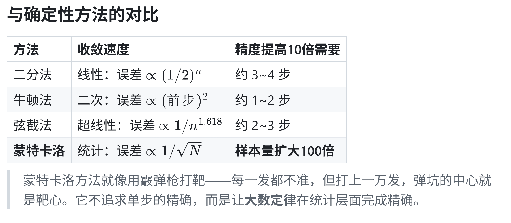

# 迭代

> 无法或没必要得到精确解的时候，如何求出足够好的近似解？

- 迭代修正（牛顿迭代法、弦截法）
- 模拟：用随机采样或逐位过程， 间接得到可用答案

## Newton-Raphson Method
> 二分法的收敛是$log_2 (N)$级别的，下面考虑更高效的方法
- 牛顿迭代法在方程的单根附近具备**平方**级别的收敛速度

考虑函数$f(x)$在区间上连续可导，求方程$f(x) = 0$的精确根$x^*$. 由于无法直接求解，我们构造迭代序列
$$x_0, x_1, x_1, ..., x_n, ...$$
使其逐步逼近真实根$x^*$.
**终止条件考虑为**:
$$
|f(x_n) - f(x_{n - 1})| < \epsilon
$$
#### 核心思想：以曲代直
> 用切线代替曲线，用线性问题逼近非线性问题。

$$
l:y - y_n = f'(x_n)(x-x_n)
$$
$$
x_{n+1} = x_n - \frac{f(x_n)}{f'(x_n)}
$$
-  **为什么这么快？**：因为切线不仅匹配了函数值，还匹配了变化率（斜率）。相当于⽤"一阶信息"做了最优局部近似，每步迭代都把误差⾥的线性主导项消除了，剩下的只是高阶小量。
#### 问题
- 牛顿法在一些大规模运算上成本高
- 牛顿法只能处理非黑箱函数
- 牛顿迭代法解析困难，手动求导困难

**能否只使用函数值，不使用导函数处理这一问题？**
- 用割线斜率即可
## 弦截法
$$
x_{n+1} = x_n - f(x_n) \frac{x_n - x_{n-1}}{f(x_n)-f(x_{n-1})}
$$
- 需要两个初始值（不需要包围根）
- 每次只需要一次函数求值
- 不需要导数，用差商近似了导数
```python
# f = x ^ 2 - 2
eps = 1e-3
x_prev, x_curr = 1.0, 2.0
while True:
	f_prev = x_prev ** 2 - 2
	f_curr = x_curr ** 2 - 2
	if abs(f_curr) < eps:
		break
	x_prev, x_curr = x_curr, x_curr - f_curr * (x_curr - x_prev) / (f_curr - f_prev)
print(x_curr)
```
- `eval(x_prev)` 把字符串当表达式求值，建议替换为`lambda`函数

## 函数
- 函数可以被视为一种可以产生作用的操作
- 函数也可以被视为一种获得值的工具
以上两种操作对应着两类不同的函数

## 多分支
```python
if Condition1:
	Statement1
elif Condition2:
	Statement2
else:
	Statement3
```

# 模拟
## 蒙特卡洛方法
### 布丰投针
1777年，法国博物学家布丰提出⼀个奇怪的问题：向画满平行线的桌面上随机扔⼀根针，针与线相交的概率是多少？
$$
P = \frac{2L}{\pi d}
$$
### Python中的随机数实现
```python
import random

for _ in range(10):
	a = random.random() # 均匀分布[0, 1)
	print(a)
```

### 蒙特卡洛算法步骤
1. 生成N个均匀随机数点
2. 判断每个点是否在圆内
3. 统计圆内点数M
4. 估算pi = 4M/N
```python
from random import random
m = 0
n = int(input())
for _ in range(n):
	x = random()
	y = random()
	if x * x + y * y <= 1: # 注意，x ** 2用的是泰勒展开，计算速度比 x * x慢很多
		m += 1
print(4 * m / n)
```


> "不要陷入分类学的泥沼。"——wk


## 大数运算
- 当数的范围超出int/double的表示范围，我们可以使用字符串模拟大数存储
### 存储方案：字符串

```python
def big_add(a, b): 
	result = "" 
	carry = 0 
	i = 1 # i=1 对应个位 a[-1]，i=2 对应十位 a[-2]，… 
	while i <= max(len(a), len(b)) or carry:
		digit_a = int(a[-i]) 
		if i <= len(a) else 0
		digit_b = int(b[-i]) if i <= len(b) else 0
		total = digit_a + digit_b + carry
		result = str(total % 10) + result # 从个位往高位算，新数位接在左边 
		carry = total // 10 
		i += 1 
		
	return result
```

